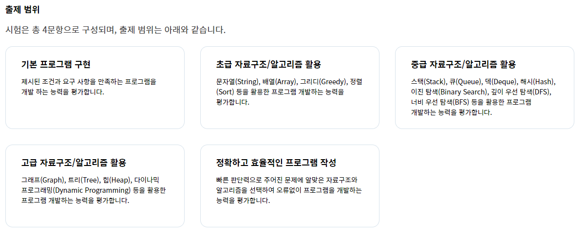

# 코딩테스트

## 학습 목표

- 코딩테스트의 목적을 이해한다.
- 코딩테스트에서 빈번하게 출제되는 유형을 알아본다.
- Java로 코딩테스트에 참가할 때의 장단점을 이해한다.

## 코딩테스트의 목적

- 빠르고 효율적으로 개발자의 실력을 가늠하기 위해 사용된다.
- 개발자의 코딩 습관을 간접적으로 확인할 수 있다.
- 공통적으로 개발자가 필요로 하는 역량을 준비할 수 있다.

## 출제 유형

- 프로그래밍 언어의 **기본 라이브러리를 이용한 효율적인 구현**
    - **반복문**과 **조건문**을 이용한 기능 구현
    - **Array 검색, 정렬 등의 Method**를 이용한 효율적인 구현
    - **예외 처리**를 이용한 모든 Test Case 해결
- **자료구조**를 이용한 기본 구현
    - Map, Set, Heap 등 특수한 기능을 갖춘 자료구조 활용
    - **자료구조만 잘 선택하면 자연스럽게 풀리는 문제**
- 잘 알려진 **알고리즘** 활용
    - Sort, Dynamic Programming, DFS, BFS, Greedy, Dijkstra, ...
    - 자료구조와 더불어, **알고리즘을 숙지하고 구현해야 해결할 수 있는 문제**
- *규격 외의 문제*
    - *위 유형에 속하지 않는, 고난이도의 문제는 기업 코딩테스트에 잘 출제되지 않는다.*

## PCCP의 범위

## Java와 코딩테스트

- Coding Test에 많이 사용되는 언어.
    - C or C++: 빠른 구동 속도와 높은 자유도로, 효율성을 중시하는 프로그래밍에 유리하다.
    - Python: 풍부한 문법과 단순한 구조로 인해 빠르고 직관적인 프로그래밍에 유리하다.
    - Java: 많이 사용되는 언어로, 극단적인 C/C++과 Python 사이의 중간 정도의 장단점을 가졌다.
- Java의 특징
    - Java Collections Framework에 구현된 자료구조를 활용하면 편리하다.
    - 문법적 요소가 많은 편이나, 함수형 프로그래밍을 통해 최대한 간결하게 사용할 수 있다.
    - 구동 속도는 보통으로, 일반적으로 코딩 테스트에서 크게 불리하지 않다.
