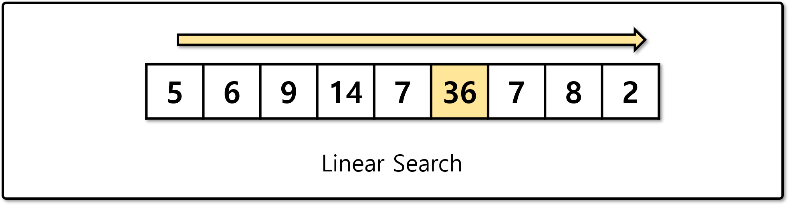
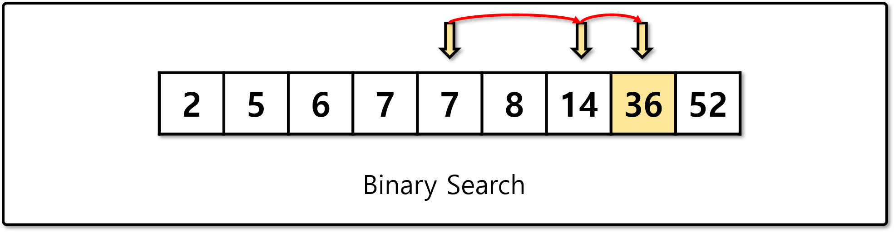

# 탐색 알고리즘

## 탐색 알고리즘이란

- 자료구조에서 원하는 조건에 맞는 자료를 찾는 것을 탐색 알고리즘이라 한다.
- 자료가 정렬되어 있는지 여부에 따라 크게 두 가지 방법으로 나뉜다.

## 선형 탐색 (Linear Search)

- 순차 탐색(Sequential search)라고도 부르며, 가장 단순한 탐색 알고리즘이다.
- 순서대로 하나씩 비교하며, 시간복잡도는 O(N)이다.

## 이분 탐색 (Binary Search)

- 이진 탐색이라고도 부르며, 정렬된 자료의 탐색에 가장 많이 사용하는 알고리즘이다.
- 탐색 범위를 절반씩 줄여가며, 시간복잡도는 O(logN)이다.

## 이분 탐색 문제 풀이

- [프로그래머스 입국심사 문제](https://programmers.co.kr/learn/courses/30/lessons/43238){:target="_blank"} ([답안 코드](https://github.com/abel-shin/pccp-java/blob/main/src/day2/Solution5.java){:target="_blank"})
- [프로그래머스 징검다리 문제](https://programmers.co.kr/learn/courses/30/lessons/43236){:target="_blank"} ([답안 코드](https://github.com/abel-shin/pccp-java/blob/main/src/day2/Solution6.java){:target="_blank"})
