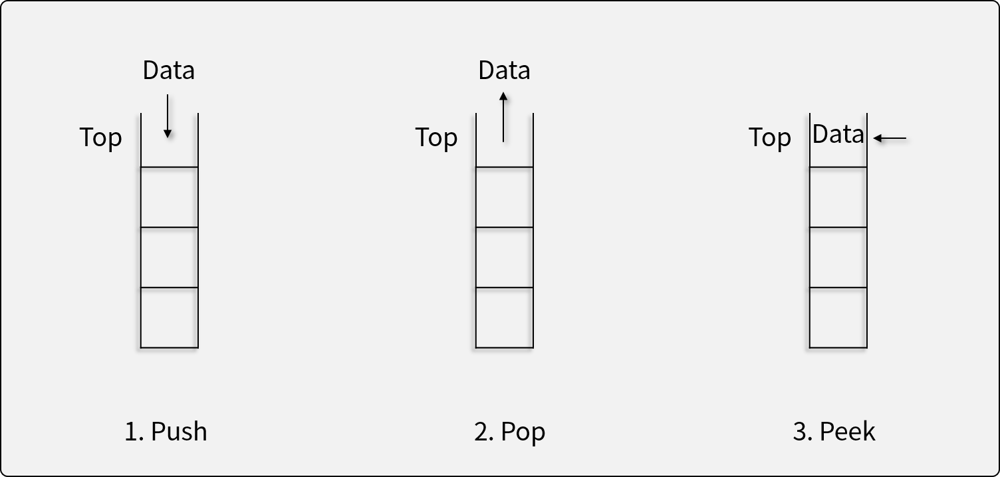

# 스택

## 스택이란

- 스택은 후입선출(Last In First Out; LIFO)의 특성을 가지는 **추상 자료형**이다.
- 자료가 입력된 순서의 역순으로 처리되어야 할 때 사용한다.
    - ex) 프로토타입 체인, 함수 콜 스택, OS 등

## 스택의 연산자



1. 자료를 Top 위에 삽입하는 연산자 (Push)
    - 더 이상 삽입할 수 없는 경우 *오버플로우* 발생
1. 자료를 Top에서 꺼내는 연산자 (Pop)
    - 더 이상 꺼낼 수 없는 경우 *언더플로우* 발생
1. Top에 있는 자료를 반환하지만, 삭제하지는 않는 연산자 (Peek)
1. 스택이 비어있는지 확인하는 연산자 (Empty)

## 스택의 구현


- 배열을 이용하여 구현한 스택
    - 배열을 사용하므로, 크기가 정해져 있다.
    - 메모리 상에서 연속으로 존재하기 떄문에 동작 속도가 빠르다.

## Java에서 스택의 사용

- `Stack<T>` 제네릭 클래스가 있으나, **속도가 아주 느리므로 쓰지 않는다.**

    ``` java title="Don't use this"
    Stack<Integer> stack = new Stack<>();
    stack.push(1);
    stack.push(12);
    stack.push(30);

    while (!stack.isEmpty()) {
        int value = stack.pop();
        System.out.println(value); // 30, 12, 1
    }
    ```

- 몇가지 기능이 추가되어 있는 `Deque<T>` 제네릭 인터페이스와 `ArrayDeque<T>` 제네릭 클래스를 사용한다.

    ``` java
    Deque<Integer> stack = new ArrayDeque<>();
    stack.push(1);
    stack.push(12);
    stack.push(30);

    while (!stack.isEmpty()) {
        int value = stack.pop();
        System.out.println(value); // 30, 12, 1
    }
    ```

    !!! note

        Deque는 데크(Dequeue)를 구현한 인터페이스이며, 스택과 큐 기능을 동시에 가지고 있다. 즉, 자료의 양 끝에서 입/출력이 모두 가능하다.


## 스택 문제 해결

- [프로그래머스 올바른 괄호 문제](https://school.programmers.co.kr/learn/courses/30/lessons/12909){:target="_blank"} ([답안 코드](https://github.com/abel-shin/pccp-java/blob/main/src/day3/Solution1.java){:target="_blank"})
- [프로그래머스 주식 가격 문제](https://school.programmers.co.kr/learn/courses/30/lessons/42584){:target="_blank"} ([답안 코드](https://github.com/abel-shin/pccp-java/blob/main/src/day3/Solution2.java){:target="_blank"})