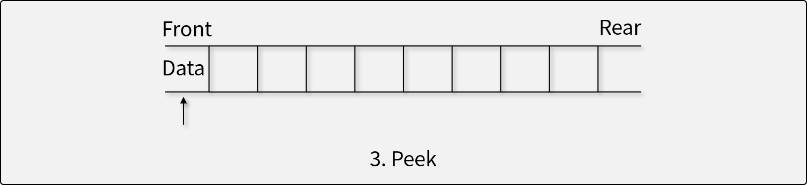

# 큐 (Queue)

## 큐란

- 큐는 선입선출(First In First Out; FIFO)의 특성을 가지는 **추상 자료형**이다.
- 입력된 데이터가 순서대로 처리되어야 할 때 사용한다. (First Come, First Served.)

## 큐의 연산자

1. 자료를 Rear로 삽입하는 연산자 (Put, Enqueue)

    - 더 이상 삽입할 수 없는 경우 *오버플로우* 발생
1. 자료를 Front에서 꺼내는 연산자 (Get, Dequeue)

    - 더 이상 꺼낼 수 없는 경우 *언더플로우* 발생
1. Front에 있는 자료를 반환하지만, 삭제하지는 않는 연산자 (Peek)


## 큐의 구현

- **선형 큐 (Linear Queue)**

    - Rear와 Front가 일직선으로 전진하는 구조.
    - 한 번 사용한 메모리 공간이 버려지는 문제가 있다.
        - 모든 요소를 앞으로 당겨주지 않으면 필연적으로 Overflow가 발생
- **환형 큐 (Circular Queue)**

    - 선형 큐의 끝 부분을 서로 연결하는 구조.
    - 한 번 사용한 메모리도 다시 활용할 수 있다.
        - 큐의 용량을 모두 사용하기 전에는 Overflow가 발생하지 않음
- **연결리스트 큐 (Linked Queue)**

    - 연결 리스트를 이용해 큐 구성
    - 물리적인 메모리를 모두 사용하기 전까지 Overflow가 발생하지 않음


## Java에서 큐의 사용

- 일반적으로 `Queue<T>` 제네릭 인터페이스와 `LinkedList<T>` 제네릭 클래스 사용

    ``` java
    Queue<Integer> queue = new LinkedList<>();
    queue.offer(1);
    queue.offer(12);
    queue.offer(30);

    while (!queue.isEmpty()) {
        int value = queue.poll();
        System.out.println(value); // 1, 12, 30
    }
    ```

## 큐 문제 해결

- [프로그래머스 기능 개발 문제](https://school.programmers.co.kr/learn/courses/30/lessons/42586){:target="_blank"} ([답안 코드](https://github.com/abel-shin/pccp-java/blob/main/src/day3/Solution3.java){:target="_blank"})
- [프로그래머스 프로세스 문제](https://school.programmers.co.kr/learn/courses/30/lessons/42587){:target="_blank"} ([답안 코드](https://github.com/abel-shin/pccp-java/blob/main/src/day3/Solution4.java){:target="_blank"})