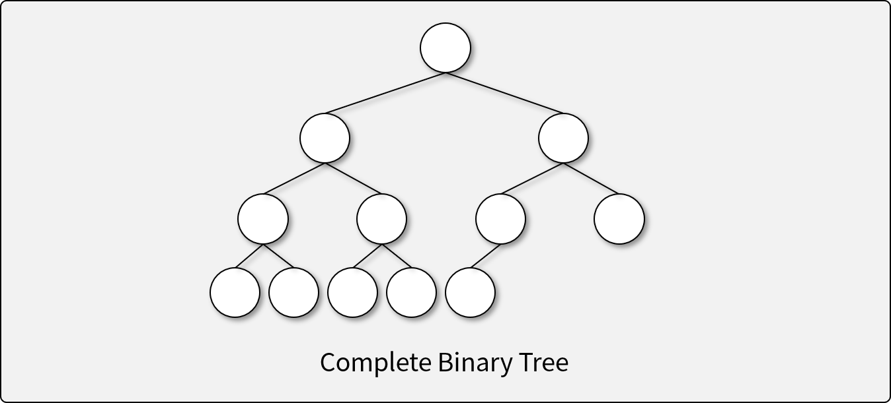
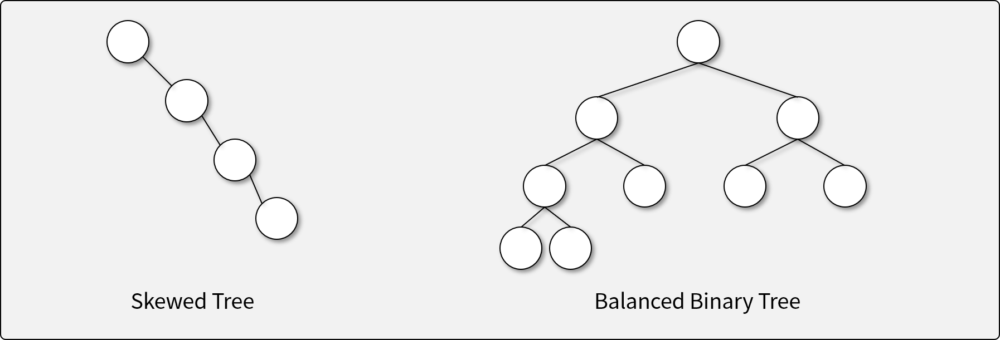
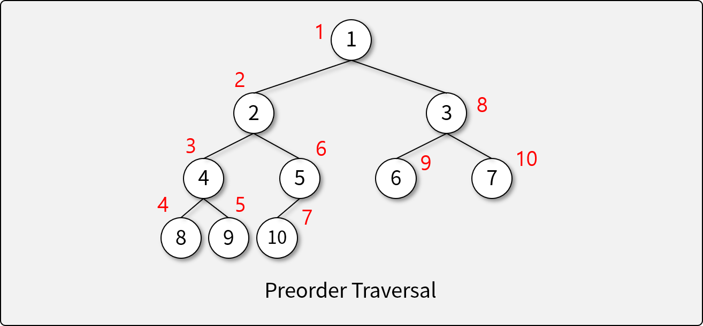
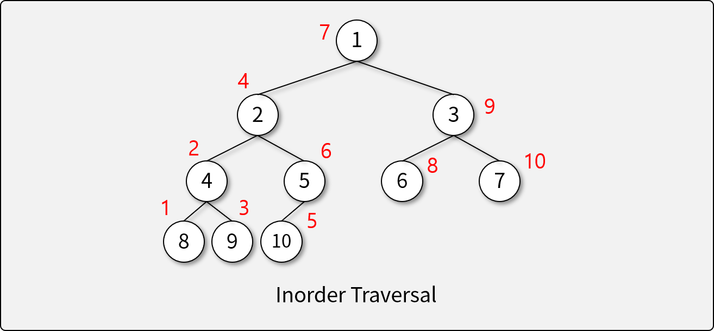
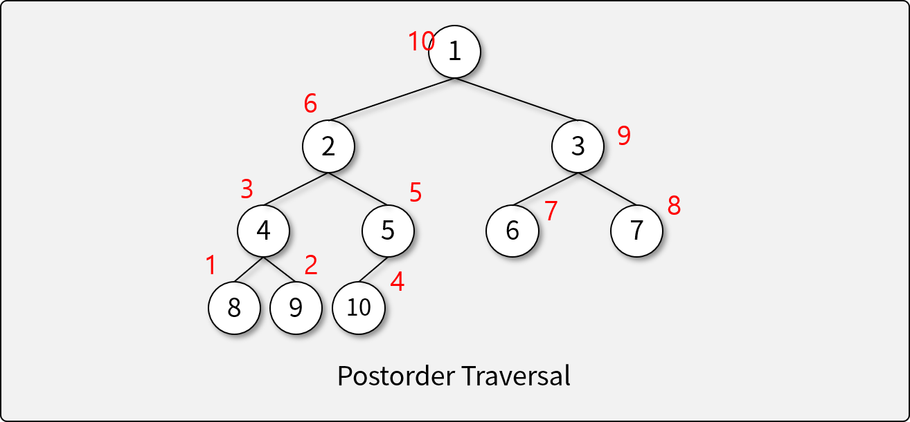
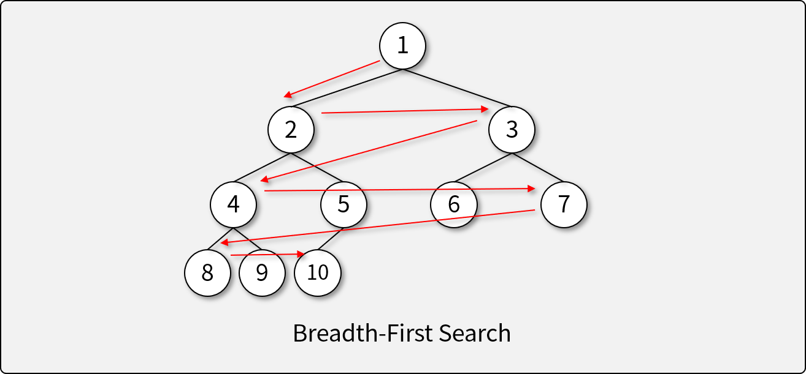

# 트리

## 트리란

- 그래프의 일종으로, 여러 노드가 한 노드를 가르킬 수 없는 구조
- 회로(Cycle)이 없고, 두 노드를 잇는 길이 하나뿐인 그래프

## 트리의 구조


- 루트(Root): 부모가 없는, 가장 상윗단의 노드
- 노드(Node): 트리 구조의 자료 값을 담고 있는 요소
- 에지(Edge): 노드 간의 연결선
- 부모(Parent): 연결된 두 노드 중 더 상위에 있는 노드
- 자식(Child): 연결된 두 노드 중 하위에 있는 노드
- 경로(Path): 두 노드를 연결하는 에지의 시퀀스
- 잎새 노드(Leaf Node): 자식 노드가 없는 노드
- 내부 노드(Internal Node): 잎새 노드를 제외한 모든 노드
- 레벨, 깊이(Level, Depth): 루트 노드로부터의 경로의 길이
- 트리의 높이(Height): 트리에서 가장 큰 레벨 값

## 트리의 특징

- 하나의 노드에서 다른 노드로 이동하는 경로는 유일
- Acyclic하다. (Cycle이 존재하지 않는다)
- 모든 노드는 서로 연결되어 있다. (외딴 섬이 존재하지 않는다.)
- 하나의 Edge를 끊으면 두개의 Sub-Tree로 분리된다.
- Edge의 수는 [Node의 수 - 1]이다.

## 이진 트리 (Binary Tree)

### 이진 트리의 종류

- 정 이진 트리 (Full Binary Tree, Perfect Binary Tree)

- 완전 이진 트리 (Complete Binary Tree)

- 균형 이진 트리 (Balanced Binary Tree)


### 이진 트리의 순회 (Traversal)

- 깊이 우선 순회 (Preorder, Depth-First Traversal) (`node` -> `left` -> `right`)

- 대칭 순회 (Inorder, Symmetric Traversal) (`left` -> `node` -> `right`)

- 후위 순회 (Postorder) (`left` -> `right` -> `node`)


### 이진 트리의 탐색 (Search)

- 너비 우선 탐색 (Breadth-First Search; BFS)

- 깊이 우선 탐색 (Depth-First Search; DFS)


    !!! note

        트리는 두 가지 탐색 방법(BFS, DFS)이 문제 해결에 가장 많이 사용된다.

## 완전 이진 트리의 구현

- 배열을 이용한 구현
    - 배열에 너비 우선 탐색 순서대로 값을 삽입

- 노드를 이용한 구현
    - 아래와 같은 `Node` 클래스를 이용하여 구현

        ```java
        class Node {
            int value;
            Node left;
            Node right;
        }
        ```

    !!! note

        완전이진트리(CBT)는 보통 배열을 이용해 구현하며, 완전이진트리가 아닌 일반적인 경우에 노드로 구현하는 경우가 많다.


## 트리의 탐색 연습

- [BFS/DFS 연습](https://github.com/abel-shin/pccp-java/blob/main/src/day4/Practice1.java){:target="_blank"}  ([답안 코드](https://github.com/abel-shin/pccp-java/blob/main/src/day4/Practice2.java){:target="_blank"})

## 트리 문제 예시

- [카카오 양과 늑대 문제](https://school.programmers.co.kr/learn/courses/30/lessons/92343){:target="_blank"}

!!! note

    트리 문제는 난이도가 천차만별로 출제될 수 있다. 고난이도 문제도 해결할 수 있도록 다양한 문제를 접해보자.

## 트리 문제 풀이

- [프로그래머스 타겟 넘버 문제](https://school.programmers.co.kr/learn/courses/30/lessons/43165){:target="_blank"} ([답안 코드](https://github.com/abel-shin/pccp-java/blob/main/src/day4/Solution1.java){:target="_blank"})
- [프로그래머스 숫자 변환하기 문제](https://school.programmers.co.kr/learn/courses/30/lessons/154538){:target="_blank"} ([답안 코드](https://github.com/abel-shin/pccp-java/blob/main/src/day4/Solution2.java){:target="_blank"})