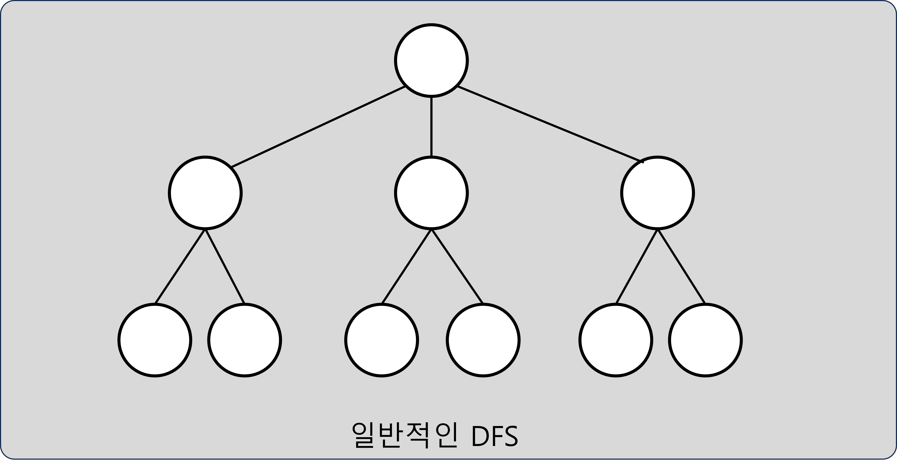
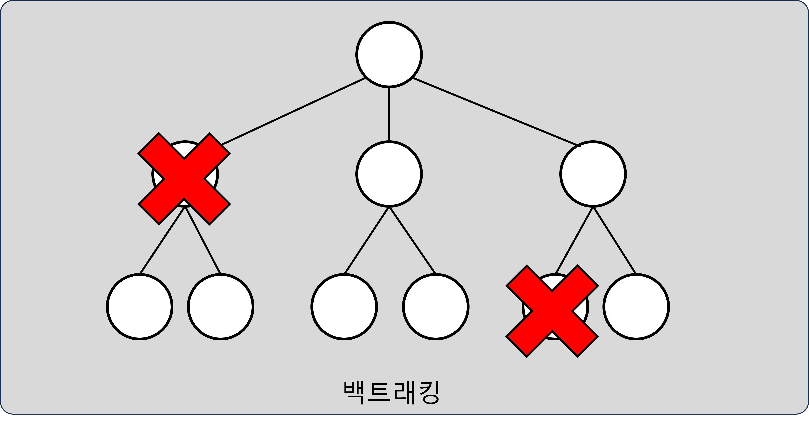
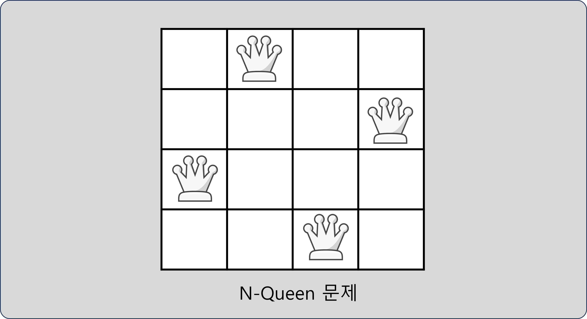
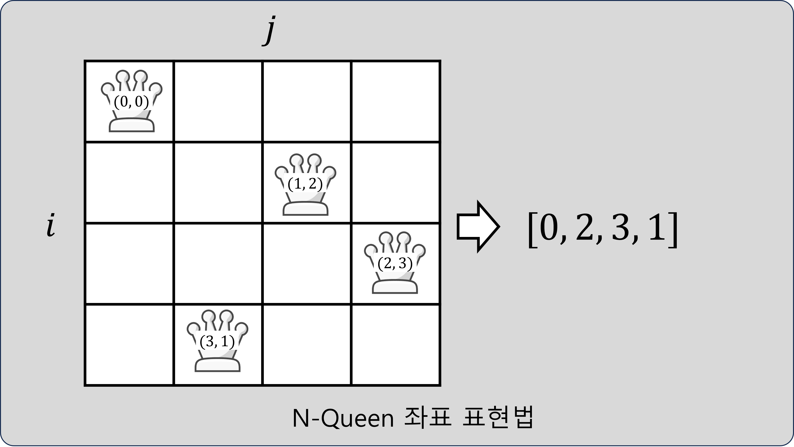
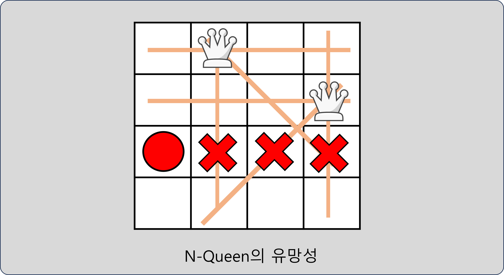

# 백트래킹

## 백트래킹이란

- DFS에서 불필요한 탐색을 줄이는 알고리즘
- 탐색 진행 중 유망성을 확인하여 가지치기(Pruning)을 수행

## 백트래킹의 원리

- DFS 진행 중 유망(Promising)한지 확인하여 탐색이 불필요한 경우 진행 중단
- 유망한지 여부를 알 수 있는 문제에만 적용 가능

## N-Queen 문제

- 문제
    - `N`x`N` 크기의 체스판에 `N`개의 퀸을 놓을 수 있는 경우의 수를 구하는 문제
    - 모든 퀸은 서로 공격할 수 없는 위치에 놓여 있어야 한다.

  

- 해결 방법
    - 각 행에 퀸을 1개씩 놓을 수 있으므로, `(i, j)` 위치에 퀸을 놓는 것을 `arr[i] = j`로 표현한다.
    - 위와 같은 표현법을 이용하면 `0` ~ `N-1`의 숫자를 총 `N`개 배열하는 문제가 된다.
    - 숫자 하나를 배열에 추가할 때 마다 유망한 자리인지 확인한다.
        - 기존에 놓여진 모든 퀸과 서로 공격할 수 없어야 유망하다.

  
  
  

## N-Queen 문제 예시

- [프로그래머스 N-Queen 문제](https://school.programmers.co.kr/learn/courses/30/lessons/12952){:target="_blank"} ([답안 코드](https://github.com/abel-shin/pccp-java/blob/main/src/day4/Solution3.java){:target="_blank"})

## 트리 문제 풀이

- [프로그래머스 여행경로 문제](https://school.programmers.co.kr/learn/courses/30/lessons/43164){:target="_blank"} ([답안 코드](https://github.com/abel-shin/pccp-java/blob/main/src/day4/Solution4.java){:target="_blank"})
- [프로그래머스 모음 사전 문제](https://school.programmers.co.kr/learn/courses/30/lessons/84512){:target="_blank"} ([답안 코드](https://github.com/abel-shin/pccp-java/blob/main/src/day4/Solution5.java){:target="_blank"})