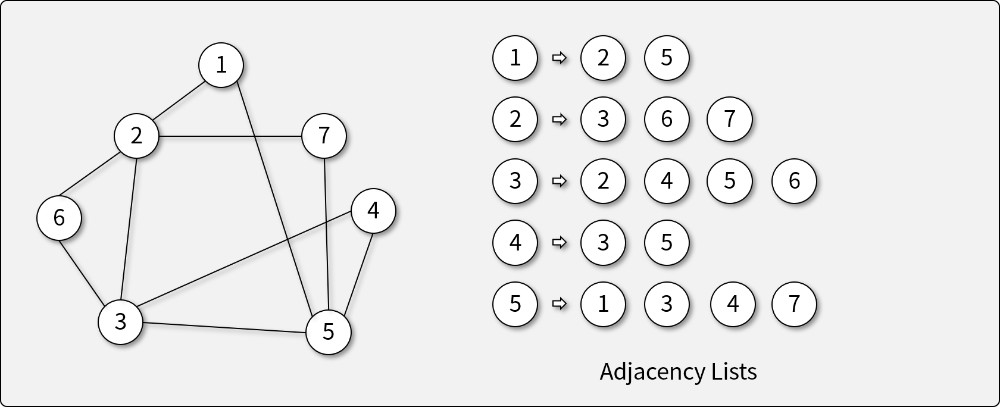
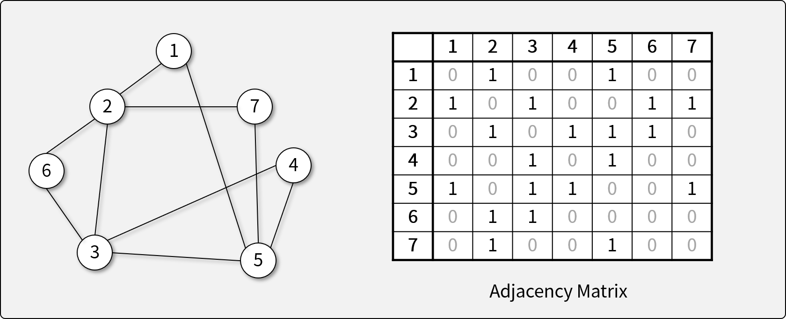

# 그래프

## 그래프란

- 객체 간에 짝을 이루는 구조를 나타내기 위한, 가장 유연한 자료 구조
- Vertex(Node, Point)와 이를 잇는 Edge로 구성되어 있다.
- Edge는 무향(Undirected) 또는 유향(Directed)일 수 있다.
- Edge에는 가중치(Weight)가 있을 수 있으며, 이는 연결의 강도를 나타낸다.

## 그래프와 트리의 관계

- 트리는 방향성 비순환 그래프 DAG (Directed Acyclic Graph)의 일종으로 볼 수 있다.
    - 트리에는 회로(Cycle)이 없으며, 루트에서 리프 노드로의 방향성(Direction)이 존재한다.

## 그래프의 종류

- 무향 그래프 (Undirected Graph)
- 유향 그래프 (Directed Graph)
- 다중 그래프 (Multigraph)

## 그래프의 관련 용어

- 경로 (Path)
- 회로 (Cycle)
- 부분 그래프 (Subgraph) - 어떤 그래프에 속하는 그래프
- 연결 그래프 (Connected Graph) - 임의의 두 Vertex 사이에 경로가 존재하는 그래프

## 그래프의 구현 방법

- 인접 리스트 (Adjacency List) - Sparse할 경우 유리함

- 인접 행렬 (Adjacency Matrix) - Dense할 경우 유리함

## 그래프의 탐색 방법

- 너비 우선 탐색 (Breadth-First Search)

    - 두 Vertex 사이의 최단 경로 or 임의의 경로를 찾을 때 사용
    - 트리와 달리 특정 Node의 방문 여부 `visited`를 검사해야 함
    - Queue를 이용하여 반복적(Iterative)인 방법으로 손쉽게 구현 가능
- 깊이 우선 탐색 (Depth-First Search)

    - 모든 Vertex를 방문하고자 할 때 주로 사용 (순회)
    - 트리와 달리 특정 Node의 방문 여부 `visited`를 검사해야 함
    - 재귀(Recursive) 함수를 이용하여 전위 순회의 형태로 구현

    !!! note

        그래프 문제는 주로 BFS, DFS로 출제된다. 그 외에는 Dijkstra, MST 등 특정 알고리즘을 사용하는 문제가 많이 출제 된다.

## 그래프의 탐색 연습

- [BFS/DFS 연습](https://github.com/abel-shin/pccp-java/blob/main/src/day5/Practice1.java){:target="_blank"} ([답안 코드](https://github.com/abel-shin/pccp-java/blob/main/src/day5/Practice2.java){:target="_blank"})

## 그래프 문제 풀이

- [프로그래머스 가장 먼 노드 문제](https://school.programmers.co.kr/learn/courses/30/lessons/49189){:target="_blank"} ([답안 코드](https://github.com/abel-shin/pccp-java/blob/main/src/day5/Solution1.java){:target="_blank"})
- [프로그래머스 단어 변환 문제](https://school.programmers.co.kr/learn/courses/30/lessons/43163){:target="_blank"} ([답안 코드](https://github.com/abel-shin/pccp-java/blob/main/src/day5/Solution2.java){:target="_blank"})
- [프로그래머스 게임 맵 최단거리 문제](https://school.programmers.co.kr/learn/courses/30/lessons/1844){:target="_blank"} ([답안 코드](https://github.com/abel-shin/pccp-java/blob/main/src/day5/Solution3.java){:target="_blank"})