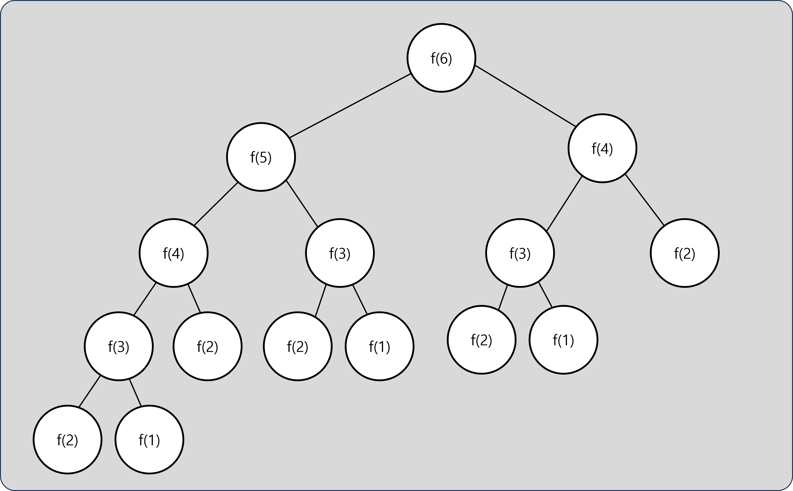
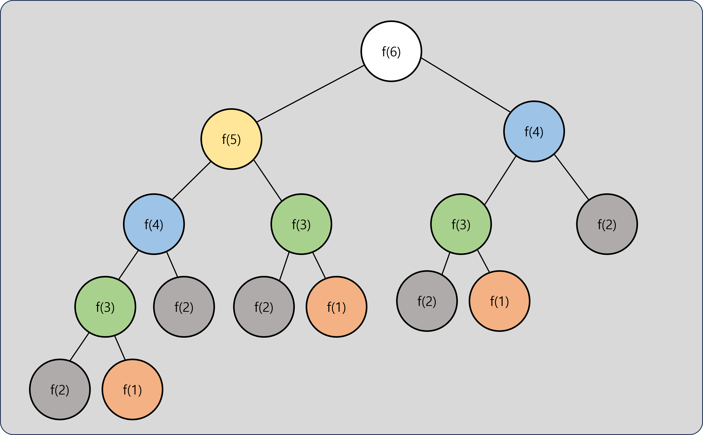
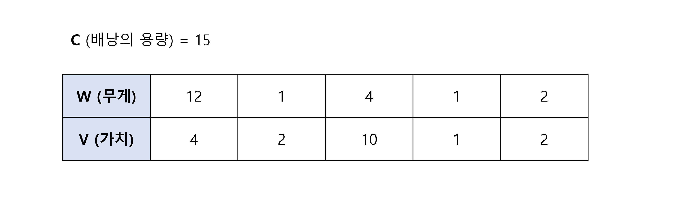
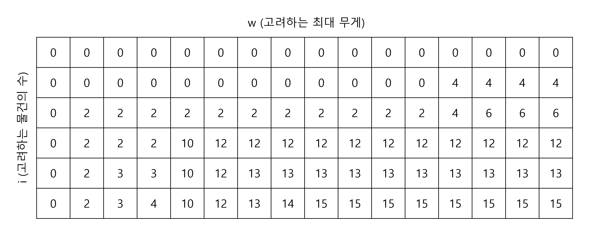

# 다이나믹 프로그래밍

## 다이나믹 프로그래밍이란

- 다이나믹 프로그래밍(Dynamic Programming; DP)란 하나의 큰 문제를 여러 작은 문제로 나눈 후에 결과를 저장하여, 동일한 문제를 풀 때 재활용하는 방법을 말한다.
- 문제 해결 결과를 저장하여 재활용하는 기법을 메모이제이션(Memoization)이라고 부른다.

## 다이나믹 프로그래밍의 조건

- 겹치는 부분 문제 (Overlapping subproblems)
    - 다이나믹 프로그래밍은 동일한 작은 문제가 반복해서 나타나는 경우에 가능하다.
    - 동일 문제가 반복해서 나타나지 않으면 메모이제이션을 해도 쓸 데가 없다.
- 최적 부분 구조 (Optimal Substructure)
    - 부분 문제의 최적 결과값을 사용해 전체 문제의 최적 결과를 낼 수 있어야 한다.
    - 부분 문제를 풀이한 결과가 최종 결과에 그대로 사용될 수 있어야 하기 때문

## 다이나믹 프로그래밍의 예

### 피보나치 수열

- 피보나치 수열은 대표적으로 다이나믹 프로그래밍이 적용되는 예시다.
- 피보나치 수열을 DP를 사용하지 않고 구현할 경우, 시간복잡도는 `O(2^N)`이 된다.

- DP를 사용할 경우 각 문제를 한번씩만 풀게 되므로 `O(N)`으로 개선할 수 있다.
    - 한번 피보나치 수열 값은 **배열**이나 **해시 테이블**에 저장해 두고 재활용한다.

- [피보나치 수열 구현 연습](https://github.com/abel-shin/pccp-java/blob/main/src/extra/Practice1.java){:target="_blank"} ([답안 코드](https://github.com/abel-shin/pccp-java/blob/main/src/extra/Practice2.java){:target="_blank"})

### 0-1 배낭 문제 (0-1 Knapsack Problem)

- **무게**와 **가치**가 정해진 `N`개의 물건이 있을 때, **제한된 용량**의 배낭에 담을 수 있는 최대의 가치를 찾는 문제
- 테뷸레이션(Tabulation) 방법으로 해결하는 대표적인 Bottom-Up 형식의 DP 문제이다.
    - 테뷸레이션: DP값을 배열에 순서대로 채워나가는 DP 구현 방법

- 배낭 문제의 DP 테이블
    - `DP[i+1][w]` : `0`번째 물건부터 `i`번째 물건 까지 고려했을 때, `w` 무게를 사용해서 만들 수 있는 최대 가치
    - 점화식: `DP[i+1][w] = max(DP[i][w], DP[i][w-W[i]] + V[i])`
        - `i`번째 물건을 넣는 것이 더 좋은지, 넣지 않는 것이 더 좋은지 비교하여 결정
    - `DP[N][C]`에 계산된 값이 정답이 된다. (모든 물건을 고려하고, `C` 무게까지 모두 사용했을 때 만들 수 있는 최대 가치)

- [0-1 배낭 문제 연습](https://github.com/abel-shin/pccp-java/blob/main/src/extra/Practice3.java){:target="_blank"} ([답안 코드](https://github.com/abel-shin/pccp-java/blob/main/src/extra/Practice4.java){:target="_blank"})

## 다이나믹 프로그래밍 문제 풀이

- [프로그래머스 등굣길 문제](https://school.programmers.co.kr/learn/courses/30/lessons/42898){:target="_blank"} ([답안 코드](https://github.com/abel-shin/pccp-java/blob/main/src/extra/Solution1.java){:target="_blank"})
- [프로그래머스 도둑질 문제](https://school.programmers.co.kr/learn/courses/30/lessons/42897){:target="_blank"} ([답안 코드](https://github.com/abel-shin/pccp-java/blob/main/src/extra/Solution2.java){:target="_blank"})
