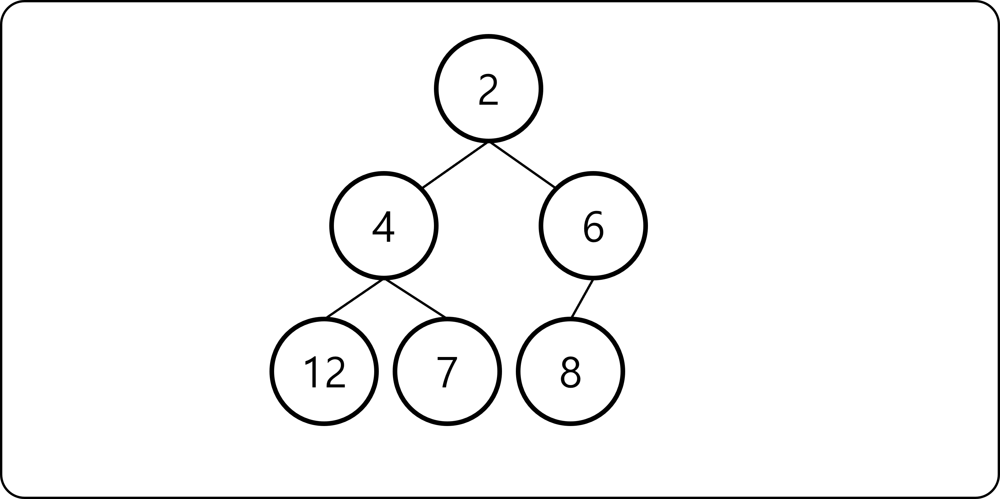
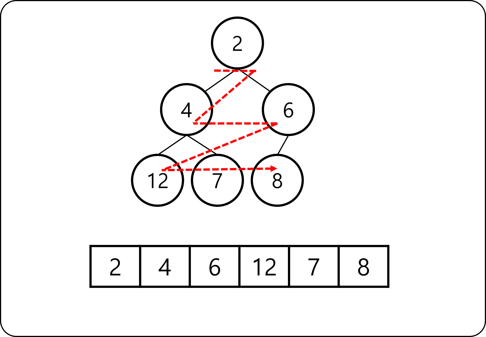
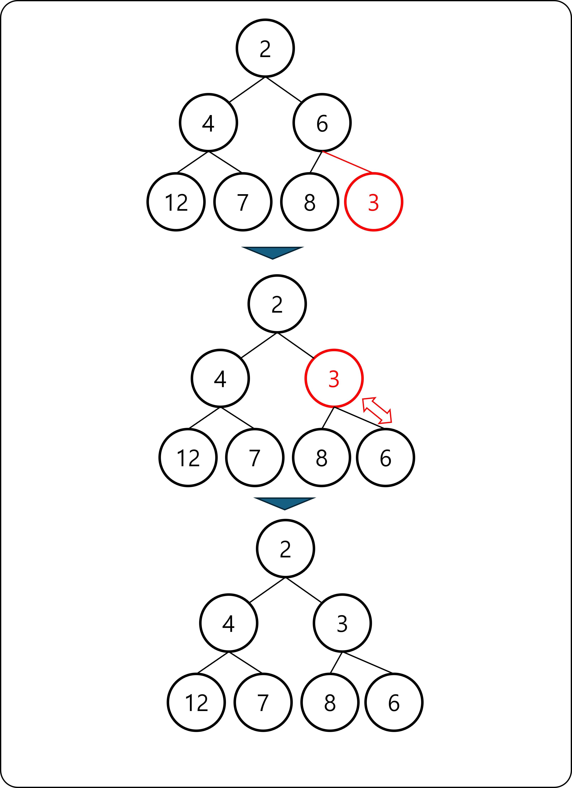
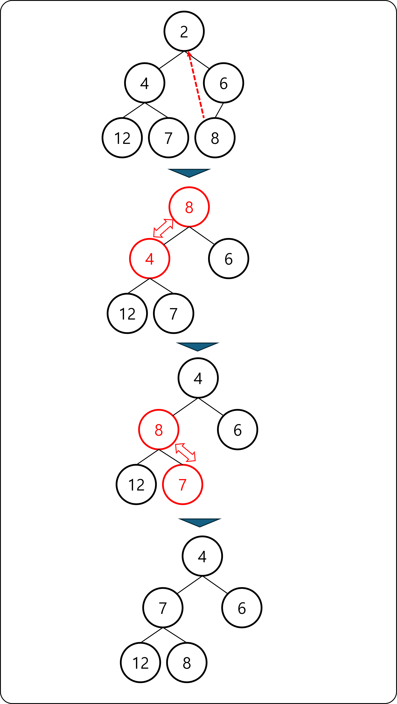

# 힙

## 힙(Heap)이란

- 항상 전체 자료 중 가장 작은 값(큰 값)이 루트에 위치하는 트리를 Min Heap(Max Heap)이라고 한다.
- 우선순위가 높은 것 부터 처리한다고 하여, 우선순위큐(Priority Queue)라고도 부른다.
- 자료의 삽입과 삭제의 시간 복잡도가 `O(logN)`으로, 빈번하게 삽입과 삭제가 이루어지는 경우에 유리

## Min Heap의 조건

- 정 이진 트리 (Full Binary Tree)여야 한다.
- 부모 노드의 값은 자식 노드의 값보다 크지 않아야 한다.



## Min Heap의 구현

### 트리 구현 방법

- 정 이진 트리이기 때문에 배열로 구현할 수 있다.
- 트리를 BFS한 순서대로 인덱싱하여 배열에 순서대로 삽입



### 자료의 삽입

- 배열의 가장 마지막에 자료를 하나 추가한다.
- 부모 노드와 비교하여 더 작으면 두 노드를 교체한다.
- 루트 노드에 도달하거나 더 이상 교체할 필요가 없을 때 까지 반복한다.



### 자료의 삭제

- 배열의 마지막에 있는 자료를 루트 노드로 옮긴다.
- 자식 노드와 비교하여 더 크면 두 노드를 교체한다.
  - 양쪽 자식 중 더 작은 값과 자리를 교체한다.
- 리프 노드에 도달하거나 더이상 교체할 필요가 없을 때 까지 반복한다.




## Python에서 Heap 사용

- `heapq` 패키지를 이용하여 구현할 수 있다.
    - `heapq.heapify(x)`: 리스트 `x`를 Min Heap으로 만든다.
    - `heapq.heappush(x, y)`: 리스트 `x`에 자료 `y`를 삽입한다.
    - `heapq.heappop(x)`: 리스트 `x`에서 자료를 하나 삭제하고 반환한다.

``` python
from heapq import heapify, heappush, heappop
x = [10, 9, 5, 23, 14, 6]
heapify(x)

heappush(x, 3)
heappush(x, 6)

while x:
    print(heappop(x))
```

``` python
from heapq import heapify, heappush, heappop
x = [(1, 'hello'), (2, 'world'), (0, 'hi'), (-1, 'bye')]
heapify(x)

while x:
    print(heappop(x))
```


## 다이나믹 프로그래밍 문제 풀이

- [프로그래머스 더 맵게 문제](https://school.programmers.co.kr/learn/courses/30/lessons/42626){:target="_blank"} ([답안 코드](https://github.com/abel-shin/pccp-python/blob/main/src/extra/Solution3.py){:target="_blank"})
- [프로그래머스 디스크 컨트롤러 문제](https://school.programmers.co.kr/learn/courses/30/lessons/42627){:target="_blank"} ([답안 코드](https://github.com/abel-shin/pccp-python/blob/main/src/extra/Solution4.py){:target="_blank"})
